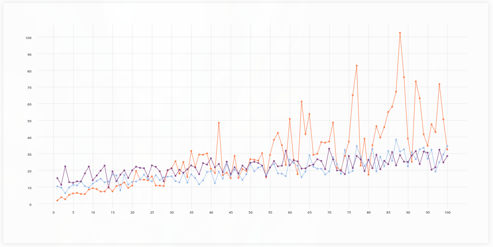

# Instructions

1. Clone the repo.
2. Install [`yarn`](https://classic.yarnpkg.com/lang/en/docs/install/#windows-stable) and run `yarn install`.
3. Start react app using `yarn start` to run preview app.
4. Create new component called `LinePlot` in `src/plots/LinePlot.js`.
5. Import `LinePlot` component to `App` component (`src/App.js`) to see it in the preview app.
6. Import necessary components (`Plot`, `GeomLine`, etc.).
7. Create plot that looks like this one:

